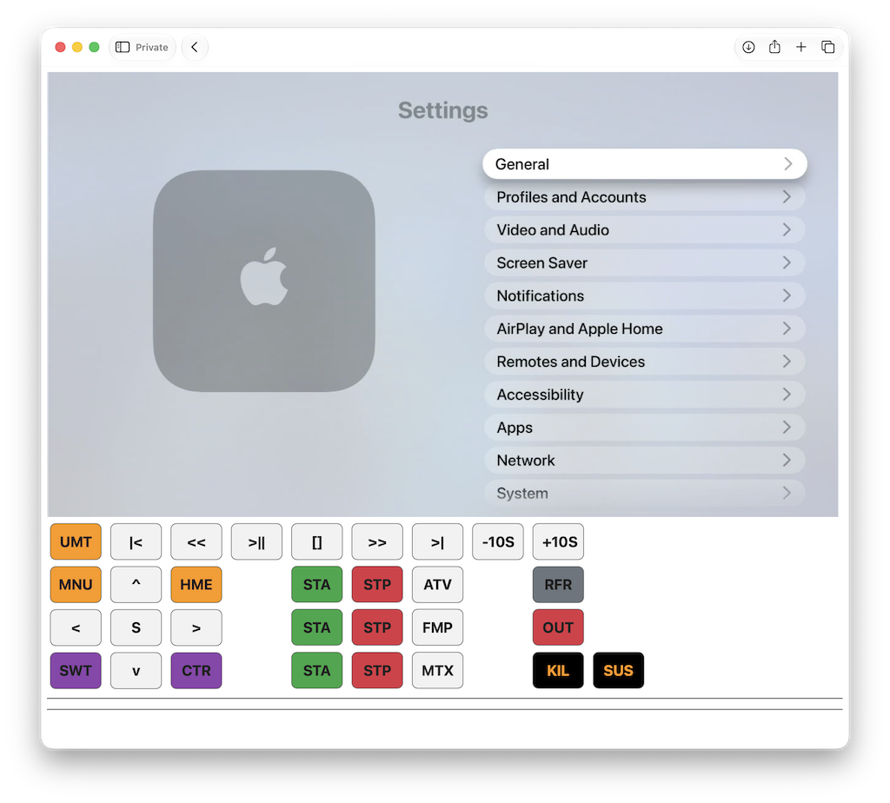

# ATV Web Gateway


A self-hosted Apple TV web gateway built with Common Lisp, ESP32 IR control, and MediaMTX streaming.

## Overview

`atv-web` is a home Apple TV gateway system that provides:

* Web control of Apple TV through an ESP32 IR transmitter
* Live Apple TV video streaming through MediaMTX
* A lightweight Common Lisp (Hunchentoot) web interface
* Remote access from browsers on the local network

The system separates control and video streaming:

* Raspberry Pi handles web control and automation
* Lenovo laptop handles HDMI capture and video streaming

## Architecture

```
Browser
   |
   | HTTP / HLS
   |
Raspberry Pi
   |
   └── Hunchentoot
          |
          └── ESP32 IR Remote
                 |
                 └── Apple TV control


Apple TV
   |
   | HDMI
   |
Lenovo Laptop
   |
   ├── USB HDMI Capture
   |
   ├── FFmpeg
   |
   └── MediaMTX
          |
          └── HLS Stream
                 |
                 └── Browser
```

## Features

* Apple TV web remote control
* ESP32 IR transmitter
* HDMI capture based Apple TV streaming
* MediaMTX HLS streaming
* Common Lisp backend
* Lightweight home-network deployment
* Daily changing access protection

## Hardware

### Control Server

* Raspberry Pi
* SBCL Common Lisp
* Hunchentoot

### Streaming Server

* Lenovo laptop
* USB HDMI capture device
* FFmpeg
* MediaMTX

### Apple TV Control

* ESP32
* IR LED transmitter

## Project Structure

```
atv-web/
├── atv-web.lisp
├── atv-web.asd
├── package.lisp
├── magic-word.example.lisp
├── atv-esp-remote/
│   ├── atv-esp-remote.ino
│   └── secrets.example.h
└── README.md
```

## Streaming Pipeline

```
Apple TV
   |
HDMI capture
   |
FFmpeg
   |
MediaMTX
   |
HLS
   |
Web Browser
```

## Security

This project is designed for personal home use.

The streaming and control interfaces should not be exposed directly to the public internet without proper authentication and HTTPS.

## License

MIT License

```
```
